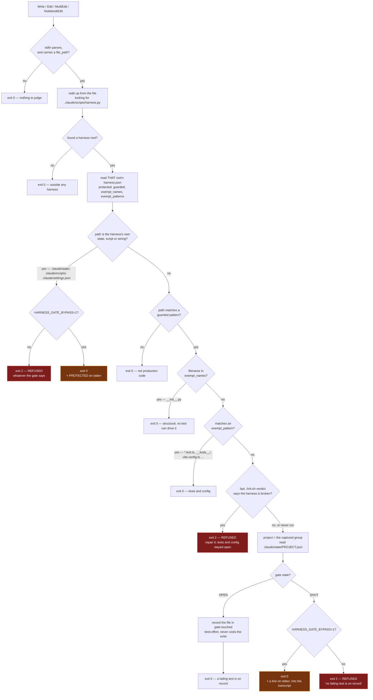
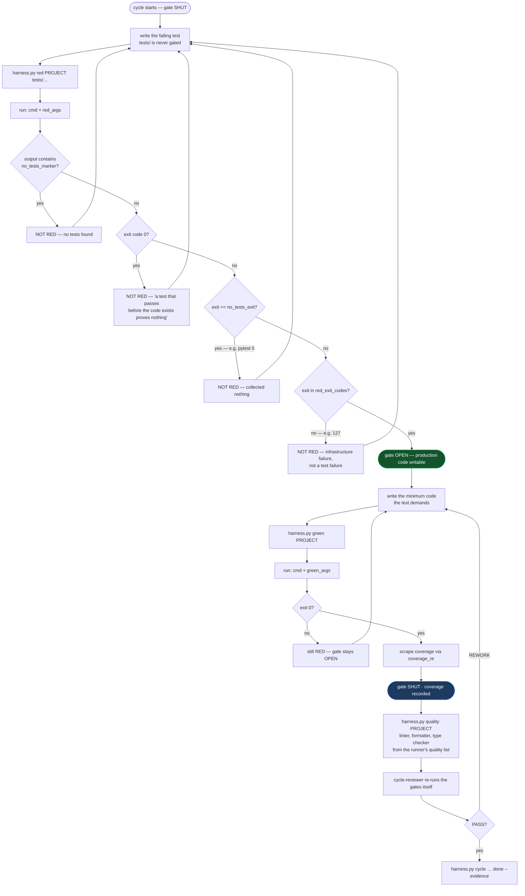
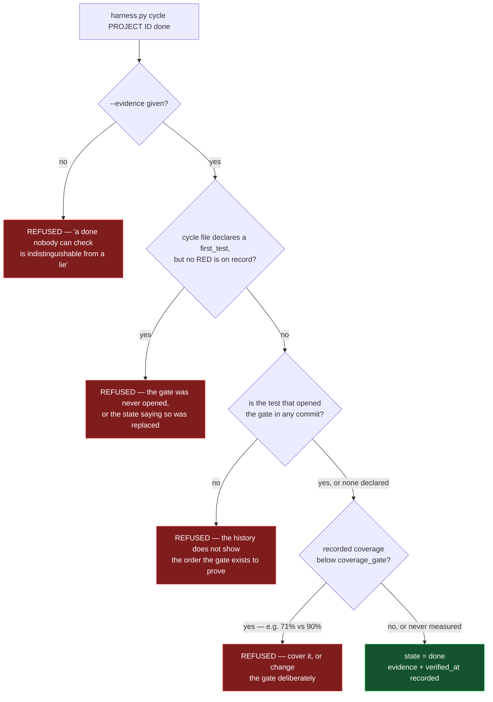
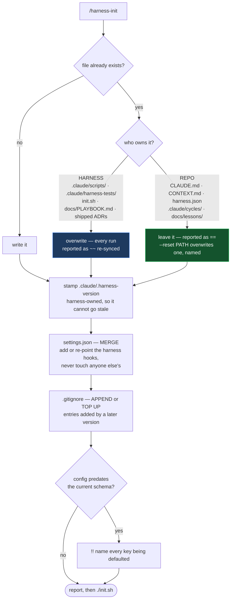
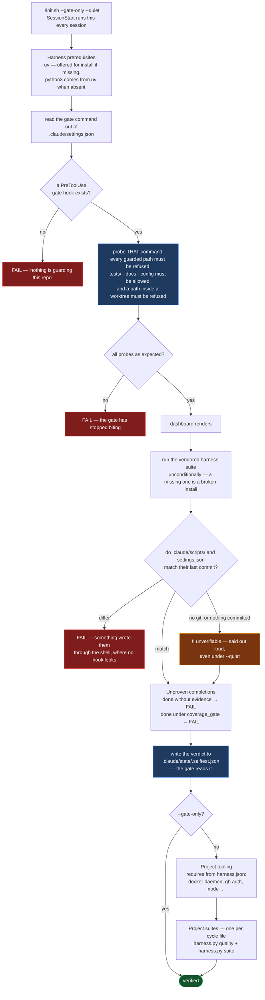
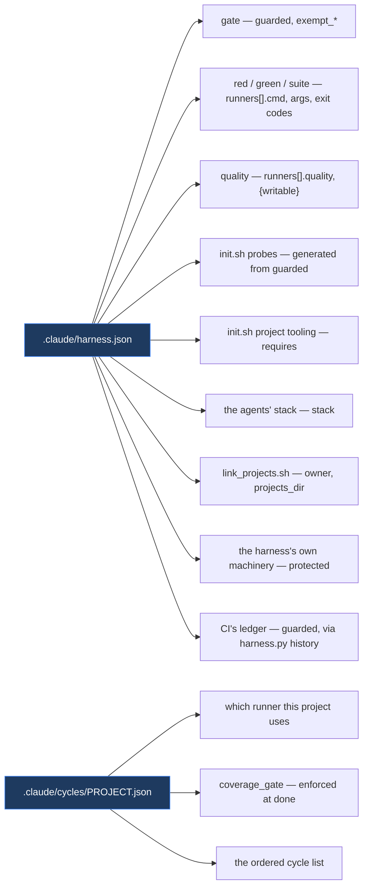

# How the harness works

Seven diagrams, each traced from the code rather than from the design. Where the order of two
checks matters, the order here is the order in the source.

- [1. The gate](#1-the-gate--pretooluse) — the one mechanism everything else exists to support
- [2. One TDD cycle](#2-one-tdd-cycle) — how the gate opens and shuts
- [3. Closing a cycle](#3-closing-a-cycle) — the four refusals
- [4. Install and re-sync](#4-install-and-re-sync) — who owns which file
- [5. `init.sh`](#5-initsh) — the verification order, which is load-bearing
- [6. What drives what](#6-what-drives-what) — the config keys, and what each one decides
- [7. The trust boundary](#7-where-each-check-runs--the-trust-boundary) — which checks an agent can step around

---

## 1. The gate — `PreToolUse`

Wired into `.claude/settings.json` as `python3 "$CLAUDE_PROJECT_DIR/.claude/scripts/harness.py" gate`,
matching `Write|Edit|MultiEdit|NotebookEdit`. **Exit 2 refuses the write; exit 0 allows it.**

Four orderings in here are deliberate and easy to get backwards:

- **The root is resolved from the file's path, not from `CLAUDE_PROJECT_DIR`.** A write inside a
  git worktree is judged by that worktree's config and state, which can legitimately differ from
  the main checkout's mid-cycle.
- **The harness's own machinery is refused first, and answers to no gate state.** An open gate
  opens `app/`; it does not open `.claude/state/`, which is what an open gate is made of.
- **The self-test's verdict is checked *after* the exemptions.** Before them, a failed verdict also
  refused tests — so the self-test's own `gate allows tests/` probe failed, the verdict could never
  clear, and the repo was unrepairable by the edits that repair it. See lesson 0013.
- **`HARNESS_GATE_BYPASS` is checked *after* the gate state.** When the gate is already OPEN the
  bypass never fires, so it cannot appear in a transcript except where it actually overrode a
  refusal.

---

## 2. One TDD cycle

`red` is the only thing that opens the gate, and it refuses four different ways — three of which
are a run that did not happen. That is the point: an infrastructure failure is not a failing test,
and accepting it would open the gate on a broken toolchain.

> Every cycle lands as two commits — `[RED]` for the failing test, `[GREEN]` for the code. The git
> log is the evidence, and the ordering it shows is the thing the gate actually proves.

---

## 3. Closing a cycle

`done` is where the claim is made, so it is where all four refusals live. None is in `green`:
coverage climbing toward the gate is the normal shape of a cycle, and refusing there would fight
the work rather than the claim.

Unmeasured coverage does not block: cycle 0 is scaffolding and runs no suite, and the evidence rule
already stands between an unmeasured cycle and a silent close.

The `first_test` check exists because the git check could be skipped by deleting what it reads.
State written by hand that simply omitted the recorded test closed a cycle with no refusal at all —
a check that runs only when its data is present is a check anyone skips by removing the data. The
cycle file is the user's own declaration, so the absence became evidence instead of an exemption.

---

## 4. Install and re-sync

`/harness-init` is also the upgrade path. Every file it writes belongs to exactly one of two sets,
and the split is the whole design — a vendored copy the installer refuses to replace strands every
fix the plugin will ever ship, and an installer that replaces everything takes the constitution and
the cycle list with it.

A runner that shares a name with a shipped one inherits the keys it did not mention, so a config
written before `quality` existed still runs. Keys the config does name always win.

---

## 5. `init.sh`

The order is load-bearing. The gate self-test proves the one thing the harness exists for, and it
needs neither Docker nor `gh` — so the project's tooling is checked *after* it, next to the suites
that need it. Putting the project's prerequisites first meant a machine with no Docker daemon
aborted before the gate was ever verified.

`suite`, not `green`: `green` shuts the gate on success, so running the health check in the middle
of a RED cycle would revoke the write permission that cycle legitimately holds.

The verdict is what makes this more than a report. Everything above `--gate-only` runs in ~0.3s on
every session start, and the gate refuses production code while the verdict says the harness is
broken — but *after* the exemptions, so tests and config stay writable. That ordering is the
difference between a brake and a brick, and getting it wrong made the repo unrepairable by exactly
the edits that repair it ([lesson 0013](lessons/0013-the-order-of-a-refusal-decides-whether-it-is-repairable.md)).

---

## 6. What drives what

Nothing outside `.claude/harness.json` names a tool. That is the property that lets a project on
poetry, pyright, golangci-lint or cargo change one file and nothing else.

---

## 7. Where each check runs — the trust boundary

This is the diagram to read if you only read one. Everything on the left runs on the machine the
agent runs on, reads state the agent can reach, and is therefore *evidence about a cooperative
agent*. Only the right-hand side is a boundary.

```mermaid
flowchart LR
    subgraph LOCAL["on the agent's machine — evidence"]
        direction TB
        G1["gate: refuses production code<br/>while the gate is SHUT"]
        G2["gate: refuses .claude/state/, scripts/, settings.json<br/>whatever the gate says"]
        G3["red: refuses a passing test,<br/>and a run that never happened"]
        G4["done: evidence · RED on record ·<br/>test in git · coverage gate"]
        G5["init.sh --gate-only, every session:<br/>probes · vendored suite · machinery vs HEAD"]
    end

    subgraph SHELL["what the shell reaches anyway"]
        direction TB
        S1["rm / echo &gt; / sed -i / python -c<br/>never pass through a PreToolUse hook"]
        S2["…so .claude/state/ can be forged.<br/>Code gets written; the cycle still cannot close."]
        S3["…but .claude/scripts/ and settings.json<br/>are committed, so init.sh sees the difference"]
    end

    subgraph CI["off the machine — boundary"]
        direction TB
        C1["harness.py history --repo .<br/>reads git log, which the harness never writes"]
        C2["a commit touching tests banks one;<br/>a commit touching guarded code spends one"]
        C3["code with nothing banked fails the PR"]
    end

    LOCAL -.->|"a determined agent<br/>steps around"| SHELL
    SHELL -.->|"and this is where<br/>it stops"| CI

    style LOCAL fill:#1e3a5f,stroke:#3b82f6,color:#fff
    style SHELL fill:#78350f,stroke:#f59e0b,color:#fff
    style CI fill:#14532d,stroke:#22c55e,color:#fff
```

Three honest statements follow from it:

1. **The local gate is not a security boundary.** An agent that can run `Bash` has the user's
   permissions. It defends against drift and shortcuts, which is what actually happens, not against
   an adversary.
2. **The two halves of `protected` differ.** `.claude/scripts/` and `settings.json` are committed,
   so a shell write to them is caught in 43ms by comparing against `HEAD`. `.claude/state/` is
   gitignored and gets nothing — forging it buys writing code without a test, and buys no closed
   cycle.
3. **`tdd-ordering.yml` is the part that does not depend on the rest.** Forty lines of YAML, one
   `git log` walk, running where the branch cannot edit the verdict. If you adopt one thing from
   this repo, adopt that file.
